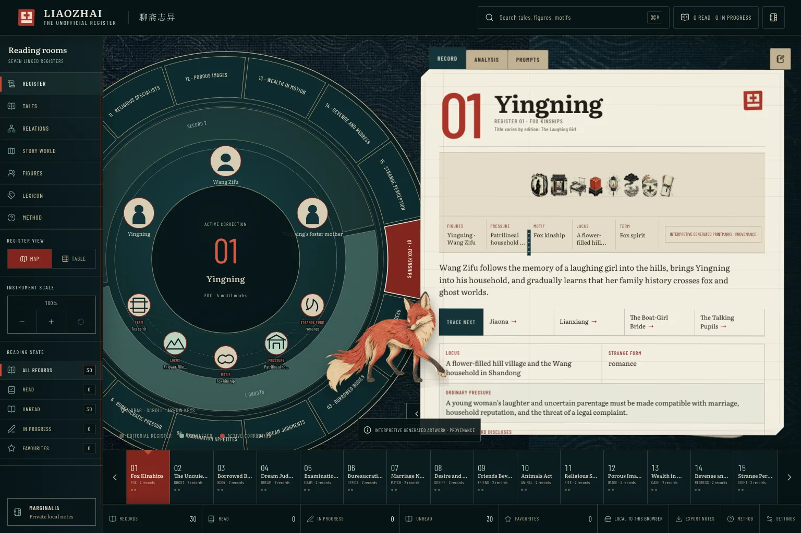
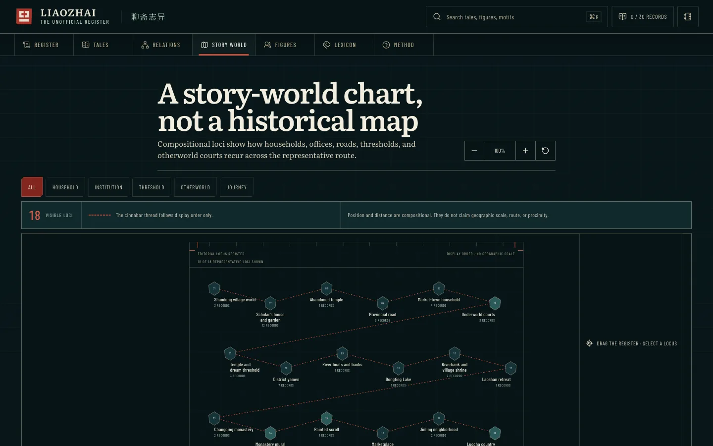

# Liaozhai: The Unofficial Register

**Live: [{{PORTFOLIO_URL}}/demos/liaozhai/]({{PORTFOLIO_URL}}/demos/liaozhai/)**

A reading instrument for Pu Songling's *Strange Tales from a Chinese Studio*
(*Liaozhai zhiyi*), read in English translation. It is the third of my reading
instruments, after [Metamorphoses](https://metamorphoses-chronology.vercel.app/)
and the Odyssey, and it carries the same design onto React and TypeScript.



## Why it exists

The collection has hundreds of tales and no single plot. A reader needs paths
through it, plus quick context on recurring figures, on institutions like the
civil-service examination, and on motifs like fox spirits.

## What is in it

- **The register.** A draggable, zoomable concentric dial that groups 30
  representative tales into 15 editorial reading paths, two tales each, with a
  live dossier for whatever sits under the pointer. The paths are thematic, not
  Pu Songling's order, and every summary is paraphrase, not quotation.
- **Map and table.** The same selection switches between the dial and a dense
  tale ledger with reading percentages and favourites.
- **Relations.** A React Flow graph connecting the selected tale to its figures,
  motifs, institutions and cross-tale echoes.
- **Story world.** A pannable chart of recurring story places. It says on its
  face that it is not a historical map.
- **88 figure slips**, a 27-entry lexicon, search across everything, and
  progress and notes that stay in your browser (export and merge as JSON).



## Run it

```bash
npm install
npm run dev          # local dev server
npm run build        # hosted build in dist/ plus a one-file offline build in standalone/index.html
npm test             # Vitest: catalog counts, dial geometry, reading state
npm run test:visual  # Playwright: five viewports, 200% zoom, reduced motion, axe WCAG A/AA scans
```

The offline build is a single HTML file you can double-click with no server and
no network.

## How it is built

React owns state and SVG rendering. The dial geometry is pure TypeScript in
`src/lib/radial.ts`, so it is testable without a browser. The catalog in
`src/data/` is typed, and a Vitest test asserts the exact record counts and that
every reading path holds exactly two tales, so a bad data edit fails the run.
GSAP turns the dial to the chosen slot; the relationship graph and the story
chart load only when opened.

Asset provenance, including which textures are generated art rather than period
material, is in [public/ASSET-CREDITS.md](public/ASSET-CREDITS.md). Fonts
(Literata, Noto Serif SC, Barlow Condensed) are SIL Open Font License, with their
notices in `public/licenses/`.

Joseph Blumberg · josephblumberg325@gmail.com
